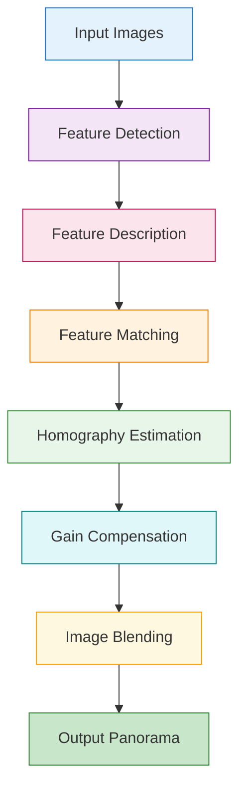
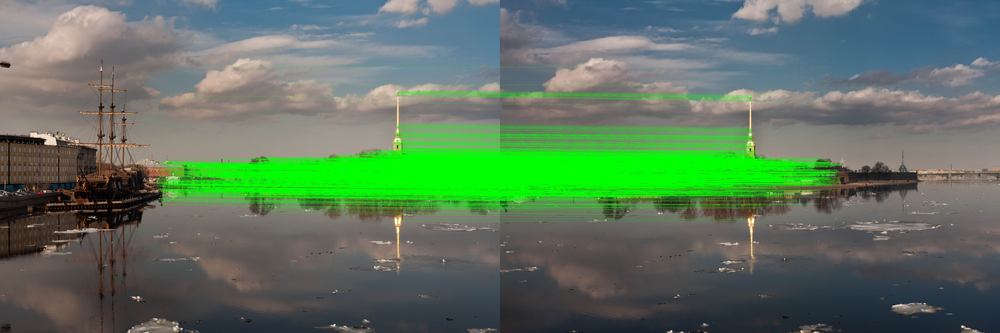
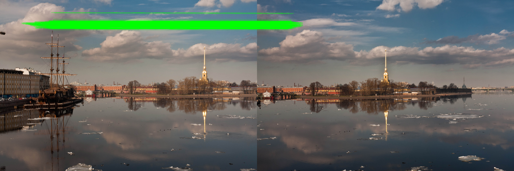
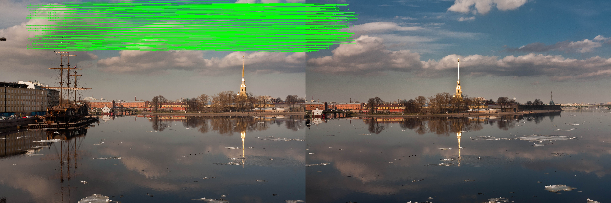
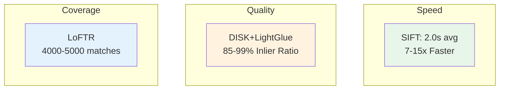

# PanoStitch

A modular panoramic image stitching pipeline featuring both classic algorithms and modern Deep Learning integrations.

## Overview

PanoStitch is an intelligent panoramic image stitching system that seamlessly combines multiple overlapping images into a single high-resolution panorama. Our modular architecture supports both traditional computer vision techniques and cutting-edge deep learning approaches, offering flexibility and robustness for various stitching scenarios.

### Input Images

| Image 1                                | Image 2                                       |
| -------------------------------------- | --------------------------------------------- |
|  |  |

### Result Panorama


## Pipeline Architecture



> **Test Cases**: You can find 8 comprehensive test cases with their stitched panorama results in the `imgs/` folder (bicycle, boat, clock, dam, flower, mountain, river, tree).

## Features

- **Feature Detection**: Custom Harris Corner Detector or SIFT.
- **Feature Description**: Custom 128D HOG-based descriptors.
- **Matching**: Vectorized Brute-force matcher with Lowe's ratio test.
- **Deep Learning**: Integration with DISK + LightGlue for robust matching.
- **Homography**: RANSAC with Direct Linear Transform (DLT).
- **Processing**: Gain compensation for exposure correction and weighted blending.

## Installation

```bash
pip install -r requirements.txt
```

## Usage

### Basic Usage (Recommended)

Stitch all images in a directory using the standard SIFT pipeline:

```bash
python panostitch.py imgs/boat/
```

### Comparing Methods

**1. Custom "From Scratch" Implementation (Harris + HOG Descriptors)**

```bash
python panostitch.py imgs/boat/ --harris
```

**2. Deep Learning Pipeline (DISK + LightGlue)**

```bash
python panostitch.py imgs/boat/ --dnn
```

## Benchmark Comparison

We benchmarked three matching methods across 8 scenes: traditional **SIFT**, and deep learning approaches **LoFTR** and **DISK+LightGlue**.

### Feature Matching Visualization

| SIFT (Traditional) | DISK+LightGlue (Deep Learning) | LoFTR (Deep Learning) |
|--------------------|-------------------------------|-----------------------|
|  |  |  |

### Speed Comparison

| Method | Avg Time | Min | Max |
|--------|----------|-----|-----|
| **SIFT** | 2.0s | 0.46s | 7.92s |
| **DISK+LightGlue** | 14.8s | 12.9s | 16.3s |
| **LoFTR** | 30.1s | 25.2s | 32.5s |

### Match Quality by Scene

| Scene | Method | Matches | Inliers | Inlier Ratio |
|-------|--------|---------|---------|--------------|
| **boat** | SIFT | 3836 | 3227 | 84.1% |
| | DISK+LightGlue | 1238 | 1209 | **97.7%** |
| | LoFTR | 4503 | 1963 | 43.6% |
| **dam** | SIFT | 3883 | 3856 | 99.3% |
| | DISK+LightGlue | 1319 | 1272 | 96.4% |
| | LoFTR | 4218 | 4213 | **99.9%** |
| **mountain** | SIFT | 1277 | 1267 | **99.2%** |
| | DISK+LightGlue | 1190 | 1174 | 98.7% |
| | LoFTR | 4994 | 4495 | 90.0% |
| **clock** | SIFT | 1626 | 1389 | 85.4% |
| | DISK+LightGlue | 592 | 517 | **87.3%** |
| | LoFTR | 4214 | 1541 | 36.6% |
| **bicycle** | SIFT | 774 | 558 | 72.1% |
| | DISK+LightGlue | 824 | 707 | **85.8%** |
| | LoFTR | 4606 | 1826 | 39.6% |
| **flower** | SIFT | 591 | 433 | 73.3% |
| | DISK+LightGlue | 1097 | 893 | **81.4%** |
| | LoFTR | 4060 | 1013 | 25.0% |
| **tree** | SIFT | 570 | 301 | **52.8%** |
| | DISK+LightGlue | 214 | 117 | 54.7% |
| | LoFTR | 3995 | 664 | 16.6% |
| **river** | SIFT | 2178 | 2139 | 98.2% |
| | DISK+LightGlue | 898 | 893 | 99.4% |
| | LoFTR | 4675 | 4657 | **99.6%** |

### Key Findings



**Summary**:
- **SIFT** is 7-15x faster than deep learning methods, ideal for real-time applications
- **DISK+LightGlue** achieves highest inlier ratios (85-99%) with moderate match counts  
- **LoFTR** produces the most matches but lower inlier ratios in challenging scenes
- On well-textured scenes (dam, river), all methods achieve >96% inlier ratio

# Contributors

| <a href="https://avatars.githubusercontent.com/AmiraKhalid04?v=4"></a> | <a href="https://avatars.githubusercontent.com/u/121557650?v=4"></a> | <a href="https://avatars.githubusercontent.com/u/149144312?v=4"></a> | <a href="https://avatars.githubusercontent.com/u/136710727?v=4"></a> |
| :----------------------------------------------------------------------------------------------------------------------------------------------------------------------: | :-------------------------------------------------------------------------------------------------------------------------------------------------------------------: | :-------------------------------------------------------------------------------------------------------------------------------------------------------------: | :------------------------------------------------------------------------------------------------------------------------------------------------------------------------: |
|                                                             [Amira Khalid](https://github.com/AmiraKhalid04)                                                             |                                                               [Youssef Noser](https://github.com/Exo1i)                                                               |                                                     [Hussein Mohammed](https://github.com/Hussein-Mohamed1)                                                     |                                                            [Abdulrahman Medhat](https://github.com/bedosaber77)                                                            |
