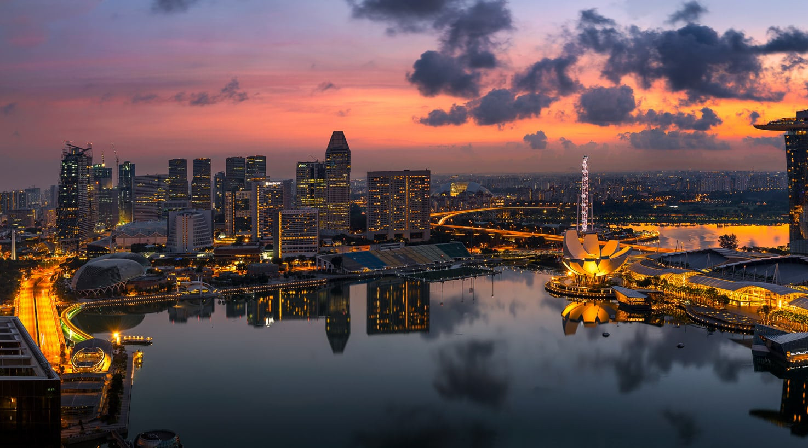
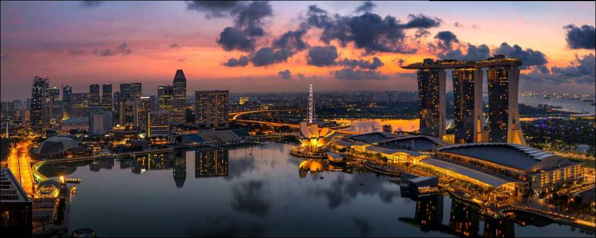

# PanoStitch

A modular panoramic image stitching pipeline featuring both classic algorithms and modern Deep Learning integrations.

## Overview

PanoStitch is an intelligent panoramic image stitching system that seamlessly combines multiple overlapping images into a single high-resolution panorama. Our modular architecture supports both traditional computer vision techniques and cutting-edge deep learning approaches, offering flexibility and robustness for various stitching scenarios.

<div style="display: flex; gap: 20px; justify-content: center; margin: 20px 0;">
  <div style="flex: 1; max-width: 45%; text-align: center; display: flex; flex-direction: column; align-items: center;">
    <p style="font-weight: bold; margin-bottom: 8px; color: #333; width: 100%;">Image 1</p>
    
  </div>
  <div style="flex: 1; max-width: 45%; text-align: center; display: flex; flex-direction: column; align-items: center;">
    <p style="font-weight: bold; margin-bottom: 8px; color: #333; width: 100%;">Image 2</p>
    
  </div>
</div>

<div style="display: flex; justify-content: center; margin: 20px 0;">
  <div style="max-width: 70%; text-align: center; display: flex; flex-direction: column; align-items: center;">
    <p style="font-weight: bold; margin-bottom: 8px; color: #333;">Result Panorama</p>
    
  </div>
</div>

## Block Diagram

This diagram illustrates the complete pipeline architecture of our panoramic stitching system:

<div style="display: flex; justify-content: center; margin: 20px 0;">
  
</div>

> 💡 **Test Cases**: You can find 8 comprehensive test cases with their stitched panorama results in the `imgs/` folder (bicycle, boat, clock, dam, flower, mountain, river, tree).

## Features

- **Feature Detection**: Custom Harris Corner Detector or SIFT.
- **Feature Description**: Custom 128D HOG-based descriptors.
- **Matching**: Vectorized Brute-force matcher with Lowe's ratio test.
- **Deep Learning**: Integration with DISK + LightGlue for robust matching.
- **Homography**: RANSAC with Direct Linear Transform (DLT).
- **Processing**: Gain compensation for exposure correction and weighted blending.

## Installation

```bash
pip install -r requirements.txt
```

## Usage

### Basic Usage (Recommended)

Stitch all images in a directory using the standard SIFT pipeline:

```bash
python panostitch.py imgs/boat/
```

### Comparing Methods

**1. Custom "From Scratch" Implementation (Harris + HOG Descriptors)**

```bash
python panostitch.py imgs/boat/ --harris
```

**2. Deep Learning Pipeline (DISK + LightGlue)**

```bash
python panostitch.py imgs/boat/ --dnn
```

# Contributors

| <a href="https://avatars.githubusercontent.com/AmiraKhalid04?v=4"></a> | <a href="https://avatars.githubusercontent.com/u/121557650?v=4"></a> | <a href="https://avatars.githubusercontent.com/u/149144312?v=4"></a> | <a href="https://avatars.githubusercontent.com/u/136710727?v=4"></a> |
| :----------------------------------------------------------------------------------------------------------------------------------------------------------------------: | :-------------------------------------------------------------------------------------------------------------------------------------------------------------------: | :-------------------------------------------------------------------------------------------------------------------------------------------------------------: | :------------------------------------------------------------------------------------------------------------------------------------------------------------------------: |
|                                                             [Amira Khalid](https://github.com/AmiraKhalid04)                                                             |                                                               [Youssef Noser](https://github.com/Exo1i)                                                               |                                                     [Hussein Mohammed](https://github.com/Hussein-Mohamed1)                                                     |                                                            [Abdulrahman Medhat](https://github.com/bedosaber77)                                                            |
